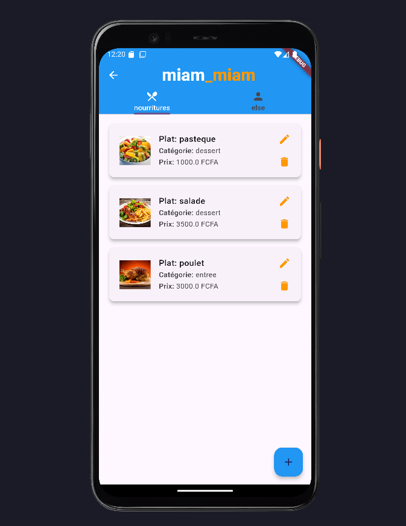
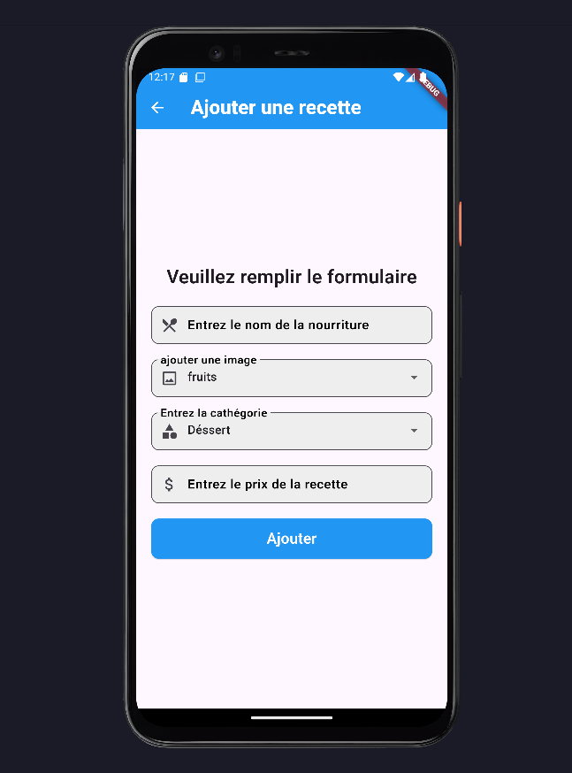
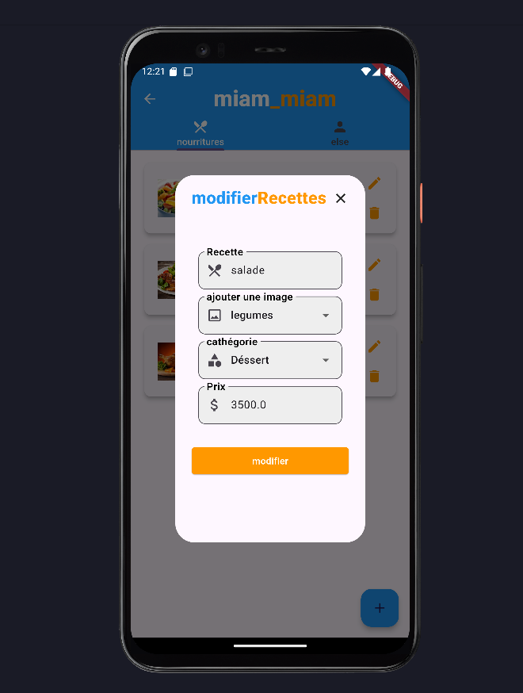
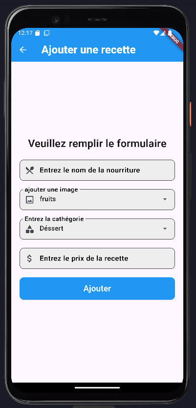

# miam_miam
Here is a small food app that I actually built; it’s my first Flutter application. miam_miam is an application that I coded to practice CRUD in Flutter.

📷 <h2>Screenshots<h2/>

### App Preview

|              ****             |             ****          |            
| :----------------------------------: | :----------------------------------: | 
|  |   | 

